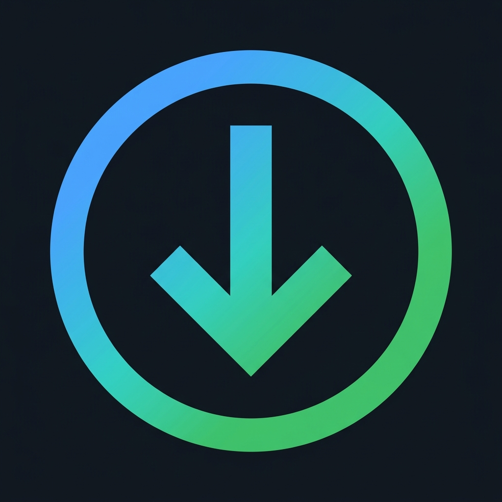

<p align="center">
  
</p>

<h1 align="center">PyDM - Python Download Manager</h1>

<p align="center">
  <em>A modern, blazing-fast, IDM-like download manager for Linux & Windows.</em>
</p>

## ✨ Features

- **Multi-segment Downloads** — Accelerates downloads using up to 16 parallel connections powered by `aria2c`.
- **Advanced Video Extraction** — Built-in `yt-dlp` integration. Automatically grabs the highest available resolution for a video (up to 4K/8K) and seamlessly merges it with the best audio track using `FFmpeg`.
- **Browser Integration** — Includes a Chrome/Chromium/Brave WebExtension that automatically captures file downloads and injects an IDM-style "Download Video" floating button over any playing media.
- **Native GUI** — A polished, responsive Dark Mode interface built with PyQt6.
- **Background Daemon** — Minimizes to the system tray, quietly managing downloads without cluttering your workspace.
- **Smart Progress Monitor** — Unified view monitoring both standard Aria2c downloads and complex segmented Yt-Dlp virtual downloads in real time.

---

## 🚀 Installation & Deployment

### Linux

We've built a one-click deployment script designed to seamlessly install PyDM natively on your Linux distribution (Arch, Ubuntu/Debian, Fedora). 

Simply open your terminal and run the interactive setup using either `wget` or `curl`:

**Using curl:**
```bash
curl -fsSL https://raw.githubusercontent.com/happy-fox-devs/pydm/main/install_pydm.sh | bash
```

**Using wget:**
```bash
wget -qO- https://raw.githubusercontent.com/happy-fox-devs/pydm/main/install_pydm.sh | bash
```

**What the installer does:**
1. Installs system dependencies (`aria2`, `ffmpeg`, `python3-venv`) via your package manager.
2. Clones the repository to `~/.local/share/pydm` (the Linux standard for user applications).
3. Creates a clean, isolated Python virtual environment explicitly for PyDM.
4. Generates Native Messaging hook JSON files so the browser can securely send links to PyDM.
5. Adds a high-resolution PyDM shortcut to your Linux Applications Menu.
6. Packages the browser extension as a `.zip` file into your Desktop for easy loading.

### Windows

Open **PowerShell** and run:

```powershell
irm https://raw.githubusercontent.com/happy-fox-devs/pydm/main/install_pydm.ps1 | iex
```

**What the installer does:**
1. Check if `aria2c` and `ffmpeg` binaries are installed, if not, download them to `%LOCALAPPDATA%\pydm\bin\`.
2. Clones the repository to `%LOCALAPPDATA%\pydm`.
3. Creates an isolated Python virtual environment.
4. Registers Native Messaging hooks in the Windows Registry for Chrome/Brave/Firefox.
5. Adds a PyDM shortcut to the Start Menu.
6. Drops the browser extension `.zip` on your Desktop.

### Connect the Browser (All Platforms)

Once installed, PyDM will place a `pydm_extension.zip` file on your Desktop. 
1. Open your browser and go to `chrome://extensions` or `brave://extensions`.
2. Toggle on **Developer mode** in the top right corner.
3. Drag and drop the `pydm_extension.zip` file directly into the page. 

You're done! Your browser will now natively reroute all standard downloads directly to the PyDM engine.

---

## 🛠️ Developer Setup (Manual)

If you wish to modify the code or run PyDM manually from source:

### Linux

```bash
# 1. Clone the repository
git clone https://github.com/happy-fox-devs/pydm.git
cd pydm

# 2. Setup isolated environment
python3 -m venv venv
source venv/bin/activate
pip install -r requirements.txt

# 3. Register Native Hooks locally
bash ./native_host/install.sh

# 4. Start the Application
python3 -m pydm.main
```

### Windows

```powershell
# 1. Clone the repository
git clone https://github.com/happy-fox-devs/pydm.git
cd pydm

# 2. Setup isolated environment
python -m venv venv
.\venv\Scripts\Activate.ps1
pip install -r requirements.txt

# 3. Ensure aria2c and ffmpeg are in your PATH
#    (install via winget, scoop, or download manually)

# 4. Register Native Hooks locally
powershell -ExecutionPolicy Bypass -File .\native_host\install.ps1

# 5. Start the Application
python -m pydm.main
```

## 🏗️ Architecture

```text
PyDM Main App (PyQt6 / QEventLoop)
    │
    ├── Aria2 Manager (QThread) ← High-speed multi-segment handler
    ├── YtDlp Manager (QThread) ← Media/DASH format extractor & FFmpeg merger
    │
    ├── Download Monitor (Polling)
    │
    └── Native Messaging Listener (Localhost TCP)
            ↑
        Bridge Process (stdio wrapper)
            ↑
        Browser Extension (WebExtension Manifest V3)
```

## 📄 License

This project is licensed under the [MIT License](LICENSE).
